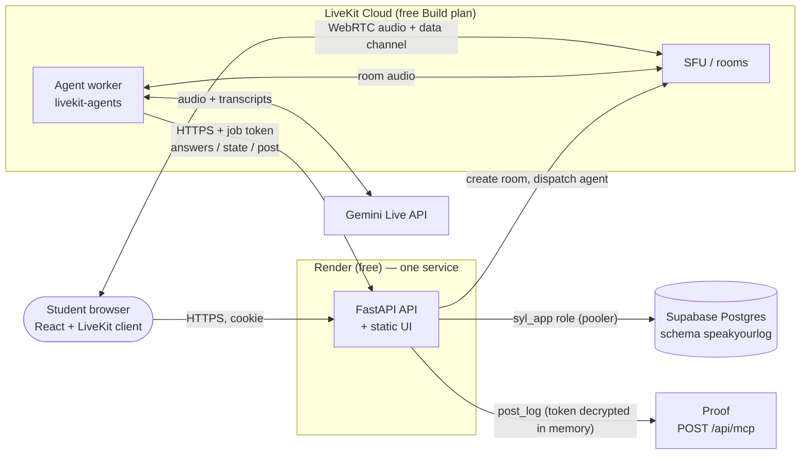
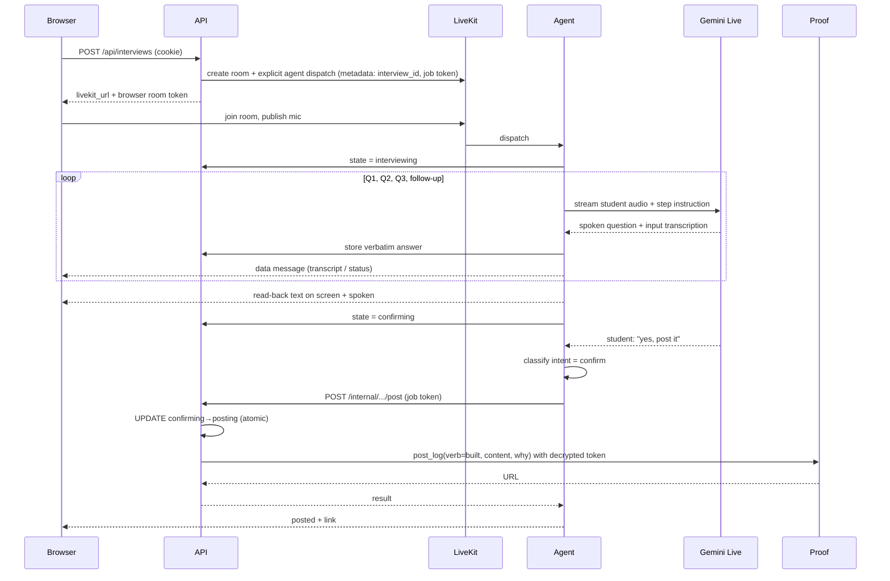

# Architecture — Speak Your Log

**Status:** Accepted · **Date:** 2026-10-01 · See [PRD](PRD.md), [SRS](SRS.md), [ADRs](adr/). Scale-out design for SaaS volumes lives separately in `docs/scale/` (Execution_plan Phase 8).

## 1. Design principles

1. **The student's words are the product.** Nothing but their transcribed speech reaches the log.
2. **The agent proposes, the backend disposes.** The voice agent drives the conversation; only the API holds secrets, builds the payload, and posts.
3. **Consent is code, not model behaviour.** The LLM talks; deterministic code decides what is recorded and posted.
4. **Least privilege everywhere.** Each component receives only the secrets it needs.
5. **Boring where possible, careful where it matters.** Plain FastAPI + Postgres; effort goes into the vault, the state machine, and the post gateway.

## 2. System context

## 3. Components and the secrets each holds

| Component | Responsibility | Secrets it holds |
|---|---|---|
| **Web (React)** | Mic, status, live transcript, read-back, consent notice | None. Only the httpOnly cookie (invisible to JS) and a short-lived LiveKit room token |
| **API (FastAPI)** | Device sessions, token vault, interview lifecycle, LiveKit room/dispatch, **post gateway** | `DATABASE_URL`, `TOKEN_ENC_KEY_*`, `SESSION_HMAC_KEY`, `AGENT_JOB_SECRET`, LiveKit key/secret |
| **Agent worker** | Voice interview, state machine, consent classification, verbatim capture | `GEMINI_API_KEY`, LiveKit key/secret. **Never** the DB, encryption key, or Proof token |
| **Postgres** | Users, hashed sessions, ciphertext vault, interview state | n/a (role-scoped access) |

## 4. Interview flow

## 5. Interview state machine

Defined in [SRS §2](SRS.md). Implemented as a pure module (`apps/agent/.../state_machine.py` for conversation steps; the `state` column + CHECK constraint for persisted state) with a transition table, so illegal moves are unrepresentable and exhaustively unit-testable. The post gateway's guard is a single SQL statement: `UPDATE … SET state='posting' WHERE id=$1 AND user_id=$2 AND state='confirming' RETURNING …` — zero rows means "not allowed or already done".

## 6. Security model

Assets: the **Proof token** (can publish publicly as the student), the student's words, the shared Supabase project.

| Threat | Control |
|---|---|
| DB leak exposes tokens | AES-256-GCM ciphertext only; key lives in the API's environment, not the DB; AAD binds ciphertext to its user |
| XSS / malicious extension steals token | Token never in browser after submit (input cleared; not returned by any endpoint); strict CSP; cookie httpOnly |
| Stolen device cookie | Cannot read the token; can only start an interview that still needs spoken consent; "Disconnect" revokes; cookie hash rotatable |
| Prompt injection via speech | LLM never decides posting; payload built server-side from stored answers; intent classifier output is a closed enum |
| Rogue agent / forged internal call | HMAC job token scoped to one interview with short expiry, delivered server-side (not through the browser) |
| CSRF | SameSite=Lax + `Origin` check + JSON-only bodies |
| API used as a token-guessing oracle | Per-IP rate limit on `PUT /api/proof-token` |
| Double post / replay | Atomic state transition; `post_unknown` instead of blind retry |
| Blast radius into the neighbouring app (Anthaathi) | Dedicated schema + `syl_app` role; no `service_role` key; verified by `db/verify_isolation.py` (14 checks) |
| Transcript leakage via logs | Logs carry interview id and event names only |
| Google using free-tier data for training | Disclosure before first session; documented upgrade path (paid tier) in scale design |

## 7. Data model

`users` ← `device_sessions` (hash of cookie) · `users` ← `proof_credentials` (ciphertext, nonce, key_id, last4) · `users` ← `interview_sessions` (state, draft JSON, result URL, timestamps). Full DDL: [`db/migrations/0001_init.sql`](../db/migrations/0001_init.sql). Schema changes are applied by the admin (the app role cannot run DDL).

## 8. Deployment (all free)

- **Render**: one Docker web service = FastAPI + prebuilt React assets (single origin → first-party cookie, no CORS). Sleeps after 15 min idle (≈1 min cold start) → keep-warm ping + "waking up" UI state.
- **LiveKit Cloud**: SFU + the hosted agent (`lk agent deploy`; 1 deployment, 5 concurrent sessions, 1,000 agent-min/month; sleeps when idle).
- **Supabase**: the user's existing project, schema `speakyourlog` only.
- **Config**: 12-factor env vars; `.env.example` documents them; production keys differ from dev keys and are set in the platform dashboards, never committed.

## 9. Observability

Structured JSON logs (event, interview_id, state, latency_ms, error class). Metrics we care about: turn latency, session completion rate, post outcome counts, Gemini error rate. No transcript text, no tokens, no cookies in logs.

## 10. Testing strategy (summary)

| Layer | What | Notes |
|---|---|---|
| Unit | State machine, payload builder (FR-14), AES-GCM vault (round-trip, tamper, wrong user, rotated key), consent classifier | Pure functions, fast |
| Integration | Device session + vault + post gateway against the real isolated schema (transactions rolled back) | `db/verify_isolation.py` already guards isolation |
| Contract | Proof client against recorded JSON-RPC responses; failure injection (timeout, 401, 429) | |
| Security | Assert token absent from every response/log; CSRF and origin checks | Part of CI |
| Agent evals | TTS-synthesised Tamil/Tanglish/English utterances through the agent; assert verbatim capture, one follow-up quoting the student, no post without `confirm` | Same technique as the spike |
| E2E | Real voice on the hosted URL (Phase 6.4) | Manual, recorded in the journal |

## 11. Known limits (MVP)

Per-device identity (no cross-device login) · Gemini Live preview model · free-tier quotas · accuracy measured on synthetic speech until Phase 6.4 · no audio retention means no after-the-fact re-transcription.
